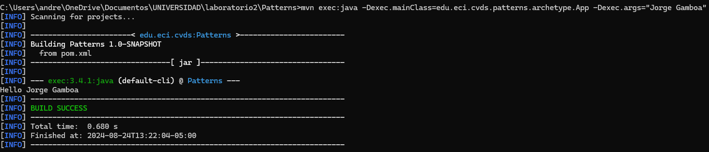
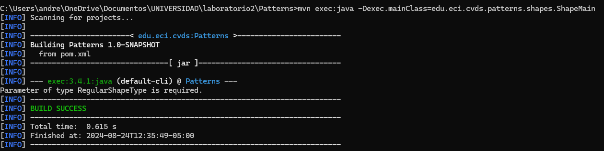
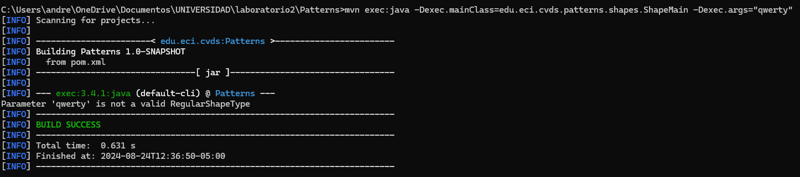
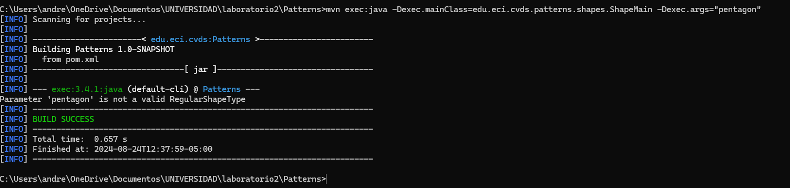
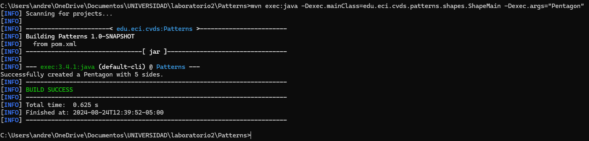
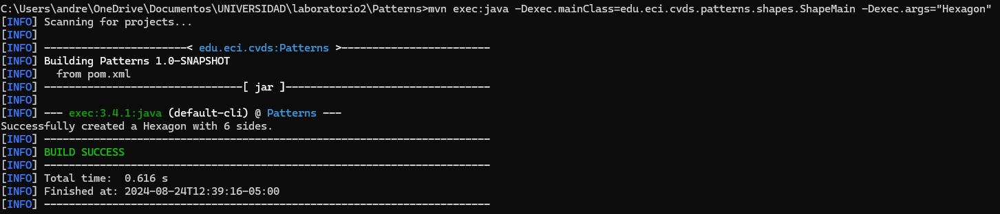

<h1> LABORATORIO 2 </h1>
<h2> Integrantes: </h2>
<h3> Andrea Camila Torres Gonzalez  </h3>
<h3> Jorge Andrés Gamboa Sierra </h3>

## Preguntas

### ¿qué es Maven?

Maven es una herramienta de automatización de construcción para proyectos Java. Facilita la gestión de dependencias, la compilación del código, la ejecución de pruebas, y el empaquetado del software. Utiliza un archivo de configuración llamado pom.xml (Project Object Model) para definir las dependencias del proyecto, los plugins y la configuración de construcción.

### ¿Qué sucedió al ejecutar la clase con el nombre y apellido?

 Al ejecutar la clase <b>App.java</b> con nombre y apellido, se imprimió el mensaje "Hello, Jorge Gamboa!" ya que al usar join, ambos argumentos se unen con un espacio en blanco entre ellos y se imprimen juntos

### ¿Cuál fábrica hiciste? y ¿Cuál es mejor?

 
 Consideramos que la mejor opción para este caso es la Simple Factory, ya que, debido a la sencillez del modelo, no es necesario implementar el patrón Abstract Factory. Además, no hay ninguna relación especial entre los objetos que requiera la creación de familias de objetos. También hemos descartado el Factory Method porque los objetos no tienen una variación significativa en su proceso de creación. Por lo tanto, la Simple Factory es suficiente para cumplir con los requerimientos solicitados.

### ¿Cuál(es) de las siguientes instrucciones se ejecutan y funcionan correctamente y por qué?

<ul>
    <li>Sin parámetros:
        
Al no mandar parámetros a la función, aparece el error <b>Parameter of type RegularShapeType is required</b> debido a que se verifica que los argumentos que recibe la función no sean nulos o diferentes de 1

        
    </li>
    <li>Parámetro: qwerty
        
Al mandar el parámetro qwerty, aparece la excepción <b>IllegalArgumentException: Parameter qwerty is not a valid RegularShapeType</b> debido a que RegularShapeType solo acepta los valores Triangle, Quadrilateral, Pentagon, Hexagon

        
    </li>
    <li>Parámetro: pentagon
        
Se produce la excepción <b>IllegalArgumentException: Parameter pentagon is not a valid RegularShapeType</b> ya que la enumeración tiene permitido el valor "Pentagon" pero este al tener la primera letra en minuscula no es aceptado.
        

        
        
Al corregirlo colocando la P en mayúscula podemos oberservar su correcta ejecución

        
    </li>
    <li>Parámetro: Hexagon
        
Este parámetro es aceptado ya que su sintaxis concuerda con el valor de la enumeración "Hexagon" por tanto, la salida que ejecuta es <b>Successfully created a Hexagon with 6 sides.</b>

        
    </li>
</ul>

## Bibliografía

<ul>
    <li>https://www.javiergarzas.com/2014/06/maven-en-10-min.html</li>
    <li>https://www.javatutoriales.com/2021/12/diferencias-simple-factory-vs-factory.html</li>
</ul>
